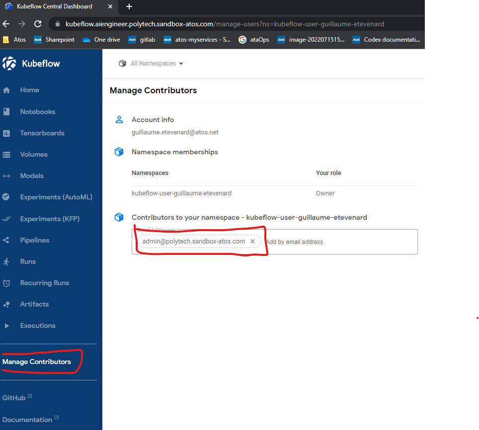

# Exam

**Find in this exam 4 notebooks, 1 exercice per notebook, 5 points per exercice**

As usual, you will work on kubeflow's notebook server. Keep your usual credentials : username = firstname-lastname, pw = whatyouset (default was also firstname-lastname).

### **To be scored, you HAVE to share your namespace with : 'admin@polytech.sandbox-atos.com'**




This time, we have created 1 notebook server per profile so you don't have to deal with upscale time, or slow python package installation (0.1 cpu --> 0.5 cpu per notebook).

This is called `notebook` and this will be the only notebook server available in your namespace.

Connect to it and pull the https://github.com/A709509/aiengineerPolytech/ repo, look at that `Exam_wine` chapter.

**tips:**
- All exercices are **independants**, and the order means **nothing**. 
- You have **full access** the the aiengineerPolytech repo and its "correction" branch to help you start the exercices. 
- We built this exam with **documentations examples** (KFP, Kserve, Mlflow) and **Stack overflow**. It should help you to fill some gaps

---

### Assets

#### Dataset

**Wine classification dataset** 

**purpose** :
Guess the wine color

**label**:
type

Data infos : 

```
Data columns (total 13 columns):
 #   Column                Non-Null Count  Dtype  
---  ------                --------------  -----  
 0   type                  6497 non-null   object 
 1   fixed acidity         6487 non-null   float64
 2   volatile acidity      6489 non-null   float64
 3   citric acid           6494 non-null   float64
 4   residual sugar        6495 non-null   float64
 5   chlorides             6495 non-null   float64
 6   free sulfur dioxide   6497 non-null   float64
 7   total sulfur dioxide  6497 non-null   float64
 8   density               6497 non-null   float64
 9   pH                    6488 non-null   float64
 10  sulphates             6493 non-null   float64
 11  alcohol               6497 non-null   float64
 12  quality               6497 non-null   int64  
dtypes: float64(11), int64(1), object(1)
```

This dataset is available on minio : 

```python
bucket = "exam-assets" 
minio_path = 'datasets/wine/wine.parquet'
```

#### Pretrained model

For the wine classification dataset, the already trained model is a : 
  `sklearn.tree.DecisionTreeClassifier()`. 
  
It has been persisted in `.joblib` file, so you can load it like : 

```python
from joblib import load
model = load(model_object)
```

This model is available on minio : 

```python
bucket = "exam-assets" 
minio_path = 'model/wine/model.joblib'
```

### SA, secrets

for minio, you can use as access_key and secret key : `minio-kserve`

---

**useful url :**

```
Kubeflow : 
    https://kubeflow.aiengineer.polytech.sandbox-atos.com/
    - Notebooks in `Notebooks` section
    - pipeline runs grouped in `Experiments (KFP)` section
    - inferences services in `Models` section
    - pipeline catalog in `pipeline` section
gitlab exercice 3 : 
    https://gitlab.aiengineer.polytech.sandbox-atos.com/aiengineer/exercice_3_cicd
mlflow : 
    https://ml-registry.aiengineer.polytech.sandbox-atos.com/
    Check you experiment to see the right scope
```
--- 

### Global scoring : 

**EX1:**

| criteria  | description  | score  |  
|---|---|---|
|  A pipeline with the right name has been submitted to your namespace.  | it should be `{{username-pipeline-exotitle-date}}` Example for this exercice : `john-doe-evalpipeline-2023-02-06T09:08:09`  |  1 |
|  Pipeline has run successfully at least once |  all components of the final pipeline should have ended successfully at least once | 2  |
|  The accuracy has been exported as pipeline metric | Looking at experiment view, we can see accurary metric related to your run  | 2  |

**EX2:**

| criteria  | description  | score  |  
|---|---|---|
|  An inference service has been submitted with the right name  | it should be `{usernameinitials}-wx where x is the attemt number` Example for this exercice : john-doe, first attempt : `jd-w1`  |  1 |
|  Inference service has ready and available status| we can see the green checkbox on model UI | 2  |
|  Model returns predictions | using the sample provided, the model returns "red" or "white"  | 2  |

**EX3:**

| criteria  | description  | score  |  
|---|---|---|
| Push to feature branch |A feature branch names `feature/{{username}}` example with john-doe : `feature/john-doe` is created from main, with updates on `pipeline_source/pipeline.py`  |  2 |
|  Create a merge request |A merge request is created from `feature/{{username}}` to `main`, with a right description of the code changes | 1  |
|  Trigger CI | Using the `git tag` command and it's official documentation, create a tag from your feature branch and push it to trigger  | 1  |
|  Print your name on KFP |  If you updated well `pipeline_source/pipeline.py` and if the pipeline went ok, your pipeline will be available in the pipeline catalog on kubeflow, then, execute it from the UI   | 1  |

**EX4:**

| criteria  | description  | score  |  
|---|---|---|
| Mlflow Experiment |Retrain informations are available in the students's MLFLOW experiment  |  3 |
|  Register model |  New model is stored on the registry, bound to the run | 2  |

